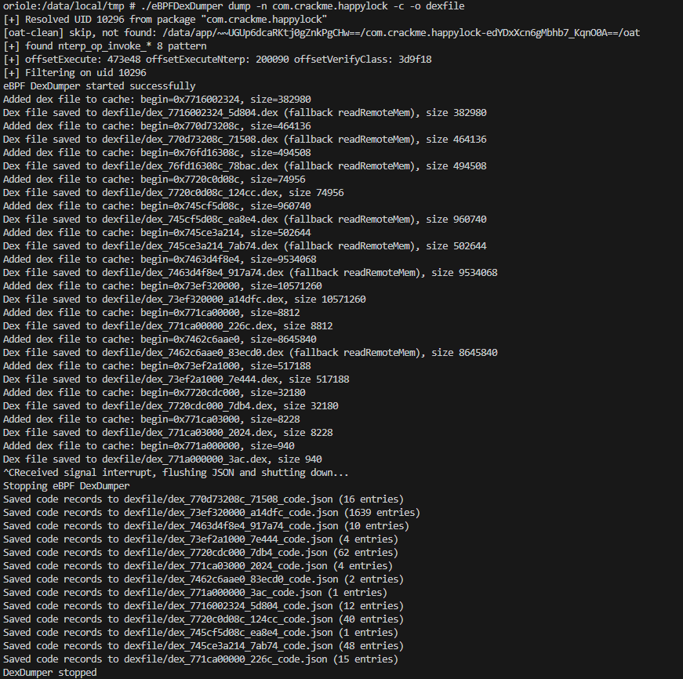
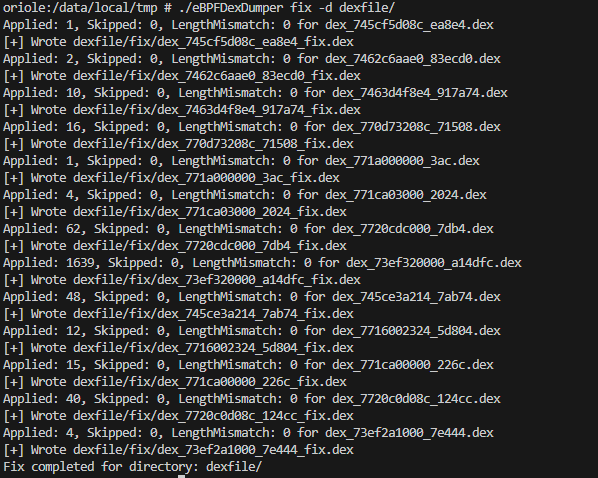

# eBPFDexDumper

[](https://golang.org/)
[](https://android.com/)

[中文](README.md) | [English](README_en.md)

基于 eBPF 技术的 Android 内存 DEX 转储工具。

## 特性
- **不可检测**: 使用 eBPF 探针进行隐蔽操作
- **被动转储**: 非侵入式内存分析
- **实时追踪**: 可选的方法执行监控
- **自动修复**: 内置 DEX 文件修复功能
- **Native 层转储与修复**: 从进程内存转储 .so 动态库(含自映射的匿名 ELF 镜像),自动从 `.dynamic` 段重建完整 section header 表,让 IDA/Ghidra 直接识别符号、导入导出与重定位。支持 **ARM64/ELF64 与 ARM32/ELF32**、**Android packed 重定位**(APS2 / RELR),可 **watch 运行时解密**、按需**过滤系统库**
- **高性能**: 使用无锁缓存和优化的字符串处理
- **简化操作**: 智能默认配置，一条命令完成转储和修复

**展示**: https://blog.lleavesg.top/article/eBPFDexDumper

## 支持环境
- **测试环境**: Android 13 (Pixel 6)
- **架构**: ARM64
- **要求**: 需要 Root 权限

**注意**: 在其他 Android 版本上可能需要微调并重新编译。

## 先决条件
工具默认会自动删除应用的 OAT 优化输出以避免 `cdex` 或空结果。如需手动操作：
- 查找基础路径: `pm path <package>`
- 删除 oat 文件夹: 删除 `/data/app/.../<package>/` 下的应用 `oat/` 目录

通常需要 Root 权限来附加探针和读取目标内存。

## 使用方法

### 命令语法
```
eBPFDexDumper [命令] [选项]
```

**可用命令:**
- `dump` - 启动基于 eBPF 的 DEX 转储器
- `fix` - 修复目录中的转储 DEX 文件
- `dumpso` - 从运行中进程的内存转储 native .so 动态库
- `fixso` - 修复目录中转储的 .so 文件

### `dump` 命令
将探针附加到 libart 并流式传输 DEX/方法事件。您必须提供 `--uid` 或 `--name` 之一来过滤目标应用。

**选项:**
- `--uid, -u <uid>` - 按 UID 过滤（`--name` 的替代方案）（默认值：0）
- `--name, -n <package>` - Android 包名以派生 UID（`--uid` 的替代方案）
- `--libart, -l <path>` - libart.so 路径（默认值：`/apex/com.android.art/lib64/libart.so`）
- `--out, -o, --output <dir>` - 设备上的输出目录（默认值：`/data/local/tmp/dex_out`）
- `--trace, -t` - 在转储期间实时打印执行的方法（默认值：false）
- `--clean-oat, -c` - 在转储前删除目标应用的 `/data/app/.../oat` 文件夹（默认值：**true**）
- `--auto-fix, -f` - 转储完成后自动修复 DEX 文件（默认值：**true**）
- `--no-clean-oat` - 禁用自动清理 OAT
- `--no-auto-fix` - 禁用自动修复 DEX
- `--execute-offset <value>` - art::interpreter::Execute 函数的手动偏移量（十六进制值，例如 0x12345）(不指定参数会自动寻找)
- `--nterp-offset <value>` - ExecuteNterpImpl 函数的手动偏移量（十六进制值，例如 0x12345）(不指定参数会自动寻找)

**示例:**
```bash
# 最简用法 - 只需指定包名，自动完成转储+清理OAT+修复DEX
./eBPFDexDumper dump -n com.example.app

# 按 UID 过滤
./eBPFDexDumper dump -u 10244

# 启用实时方法追踪输出
./eBPFDexDumper dump -n com.example.app -t

# 自定义输出目录
./eBPFDexDumper dump -n com.example.app -o /sdcard/dex_out

# 禁用自动修复（只转储不修复）
./eBPFDexDumper dump -n com.example.app --no-auto-fix

# 禁用自动清理 OAT
./eBPFDexDumper dump -n com.example.app --no-clean-oat

# 为特定 ART 版本使用手动偏移量
./eBPFDexDumper dump -n com.example.app --execute-offset 0x12345 --nterp-offset 0x67890
```

**输出文件:**
- **DEX 文件**: `dex_<begin>_<size>.dex` 保存在输出目录下
- **方法字节码 JSON**: `dex_<begin>_<size>_code.json` 在关闭时保存（SIGINT/SIGTERM）或正常退出
- **修复后的 DEX**: `fix/dex_<begin>_<size>_fix.dex` 自动修复后保存在 `fix` 子目录


### `fix` 命令
扫描目录中的转储 DEX 文件并修复头部/结构以提高可读性。

**选项:**
- `--dir, -d <dir>` - 包含转储 DEX 文件的目录（必需）

**示例:**
```bash
./eBPFDexDumper fix -d /data/local/tmp/out
```


### `dumpso` 命令
从目标进程内存中转储 native .so 动态库。与 `dump` 不同,这个功能不依赖 eBPF/uprobe,而是直接解析目标进程的 `/proc/<pid>/maps`,把同一个库分散映射的多个内存段(r--/r-x/rw-)合并还原成完整镜像,再通过 `process_vm_readv` 读出。默认还会扫描没有文件路径的匿名内存区域,只要其起始页是 ELF 魔数(`\x7fELF`),就当作自映射/自解密的库一并转储——这类不走标准动态链接器加载路径的场景,常见于对 native 层做了加固/VMP 的应用。您必须提供 `--uid` 或 `--name` 之一来选择目标进程。默认会跳过 `/system`、`/apex`、`/vendor` 等固件分区的库(它们可直接从设备镜像获取),用 `--include-system` 可保留;对运行时才解密映射的加固 so,可用 `--watch` 持续监控进程,新模块一出现就立即转储。

**选项:**
- `--uid, -u <uid>` - 按 UID 过滤(`--name` 的替代方案)
- `--name, -n <package>` - Android 包名以派生 UID(`--uid` 的替代方案)
- `--lib, -l <substr>` - 只转储路径包含此子串的库(默认转储所有应用相关的 .so)
- `--out, -o, --output <dir>` - 设备上的输出目录(默认值:`/data/local/tmp/so_out`)
- `--anon, -a` - 同时扫描自映射的匿名 ELF 镜像(默认值:**true**)
- `--auto-fix, -f` - 转储完成后自动修复 .so 文件(默认值:**true**)
- `--no-anon` - 禁用匿名 ELF 区域扫描
- `--no-auto-fix` - 禁用自动修复
- `--include-system` - 同时转储 `/system`、`/apex`、`/vendor` 下的系统库(默认跳过)
- `--watch, -w` - 持续监控进程,模块一出现就转储,内容变化(如原地解密)时再次转储(捕获运行时解密的库)
- `--watch-interval <秒>` - `--watch` 模式下重新扫描 maps 的间隔(默认值:1)
- `--watch-timeout <秒>` - `--watch` 运行多少秒后停止(0 = 直到中断,默认值:60)

**示例:**
```bash
# 最简用法 - 按包名转储该应用所有进程映射的 .so,自动修复
./eBPFDexDumper dumpso -n com.example.app

# 只转储某个特定库
./eBPFDexDumper dumpso -n com.example.app -l libnative-lib.so

# 关闭匿名 ELF 扫描，只处理正常动态链接的库
./eBPFDexDumper dumpso -n com.example.app --no-anon

# 持续监控 120 秒,捕获运行时解密映射的加固 so
./eBPFDexDumper dumpso -n com.example.app --watch --watch-timeout 120
```

**输出文件:**
- **原始 .so**: `so_<pid>_<base>_<size>_<name>.so` 保存在输出目录下
- **修复后的 .so**: `fix/so_<pid>_<base>_<size>_<name>_fix.so`,已重建完整的 section header 表,可直接丢进 IDA/Ghidra 分析

### `fixso` 命令
扫描目录中转储的 .so 文件并修复,使其可被 IDA 正确识别。

修复思路参考了 [SoFixer](https://github.com/F8LEFT/SoFixer) 但针对 Android(含 ARM64/ELF64 与 ARM32/ELF32)重写:内存 dump 出来的 so 丢失了 section header 表(加载器不映射它),IDA 只能靠 program header 勉强加载,符号/PLT/GOT 识别不全。本工具会先把 `PT_LOAD` 段的 `p_offset` 归一化到 `p_vaddr`,再**解析 `PT_DYNAMIC` 段**,从 `DT_SYMTAB/STRTAB/GNU_HASH/RELA/RELR/JMPREL/PLTGOT/VERSYM/VERDEF/VERNEED/INIT_ARRAY/FINI_ARRAY` 等 tag 反推出 `.dynsym`/`.dynstr`/`.rela.dyn`/`.rela.plt`/`.relr.dyn`/`.dynamic` 等 section 的地址与大小,按地址排序后补全各 section 尺寸,并把符号表里指向原始布局的 `st_shndx` 重映射到重建后的 section,最终追加一张完整的 section header 表。这样 IDA 就能像加载正常 so 一样识别符号、导入导出与重定位。整个流程同时支持 **ARM64/ELF64 与 ARM32/ELF32** 两种位宽(自动按 `EI_CLASS` 处理 REL/RELA 差异),并识别 **Android packed 重定位**(`DT_ANDROID_REL/RELA`,APS2 压缩)、**RELR** 压缩相对重定位与 **VERDEF** 版本定义;重建完成后会用严格的 ELF 解析器自检,报告可读的动态符号数。若目标缺少 `PT_DYNAMIC` 无法重建,则自动回退到仅归一化 `p_offset` + 清空 section header 的兜底方案(同样兼容 32/64 位)。

**选项:**
- `--dir, -d <dir>` - 包含转储 .so 文件的目录(必需)
- `--symbols, -s <file>` - 注入符号映射文件(每行 `偏移 名字`),写入真实 `.symtab`,常用于恢复 JNI 函数名。文件名形如 `jni_symbols_<模块>.txt` 时,符号只注入到名字匹配的那个 .so,不会污染同目录里的其它库

**示例:**
```bash
./eBPFDexDumper fixso -d /data/local/tmp/so_out

# 注入 dump 阶段抓到的 JNI 符号,让 IDA 显示真实函数名
./eBPFDexDumper fixso -d /data/local/tmp/so_out -s /data/local/tmp/dex_out/jni_symbols_libxxx.txt
```

### JNI 符号恢复(动态注册)

大量加固/正常 app 通过 `RegisterNatives` **动态注册** JNI 函数,这些函数在 .so 里没有导出符号,IDA 只显示 `sub_XXXX`。本工具在 `dump`(DEX 脱壳)运行时用 eBPF uprobe 挂 libart 的 `RegisterNatives`,抓取 `{函数指针, 方法名, 签名}`,按模块解析成 `偏移 名字` 写到输出目录的 `jni_symbols_<模块>.txt`;再用 `fixso --symbols` 注入到对应 dump 的 so,IDA 便能显示真实的 JNI 函数名。

```bash
# 1) 脱壳(同时抓 JNI 映射,生成 jni_symbols_*.txt)
./eBPFDexDumper dump -n com.example.app
# 2) 转储 native so
./eBPFDexDumper dumpso -n com.example.app -o /data/local/tmp/so_out
# 3) 修复并注入 JNI 符号
./eBPFDexDumper fixso -d /data/local/tmp/so_out -s /data/local/tmp/dex_out/jni_symbols_libnative.txt
```

> 注:eBPF 抓取依赖 ARM64 真机(需设备实测);`.symtab` 注入本身与架构无关,可注入任意来源(eBPF/Frida/手工)的 `偏移 名字` 映射。

### 限制与后续

- **CompactDex(cdex)**:高版本 ART 的压缩 DEX 格式。本工具会**检测并给出提示**,但暂不做 `cdex→dex` 完整转换(CodeItem 需解压重组);遇到时请先用 [vdexExtractor](https://github.com/anestisb/vdexExtractor) 等工具转换。
- **抽取型加固的主动触发**:eBPF 是**只读观测**模型,无法主动调用目标进程的方法去强制解密未执行的方法体;这类"主动脱壳"需要代码注入(如 Frida/ptrace),不在本工具的 eBPF 模型内。当前 `dump` 只捕获**运行时被执行到**的方法。

## 安装与构建

### 要求
- **Go 1.19+** 用于构建应用程序
- **Android NDK** 用于交叉编译
- **Android 设备** 具有 ARM64 架构
- 目标 Android 设备上的 **Root 访问权限**

### 构建说明
1. **克隆仓库:**
   ```bash
   git clone https://github.com/LLeavesG/eBPFDexDumper.git
   cd eBPFDexDumper
   ```

2. **如有必要调整 NDK 路径**，然后构建:
   ```bash
   # pull btf file
   ./build_env.sh

   # build
   ./build.sh
   ```

3. **推送到 Android 设备:**
   ```bash
   adb push eBPFDexDumper /data/local/tmp/
   adb shell chmod +x /data/local/tmp/eBPFDexDumper
   ```

## 故障排除

### 高版本Android中libart.so去除符号后如何寻找函数正确的偏移
脱壳工具可以自己寻找NterpExecuteImpl函数的偏移，方法是通过字节码匹配实现
```
F0 0B 40 D1 1F 02 40 B9 FF 83 02 D1 E8 27 00 6D EA 2F 01 6D EC 37 02 6D EE 3F 03 6D F3 53 04 A9 F5 5B 05 A9 F7 63 06 A9 F9 6B 07 A9 FB 73 08 A9 FD 7B 09 A9 16 08 40 F9
```

而对于Execute函数，需要在IDA中打开libart.so，搜索字符串"Interpreting"，然后查看哪些函数引用了这个字符串，通常会有两个函数引用它，而其中一个函数的传入参数数量为6，那么这个函数就是我们要找的Execute函数


### 常见问题

**1.UID而非PID**
请勿使用-u指定应用程序pid，必须指定uid，或直接使用-n指定包名

**2. 找不到二进制文件**
```bash
# 验证文件是否正确推送
adb shell ls -la /data/local/tmp/eBPFDexDumper

# 确保执行权限
adb shell chmod +x /data/local/tmp/eBPFDexDumper
```

**3. 空或不完整的 DEX 文件**
- 确保目标应用正在运行（工具默认已开启 `--clean-oat`）
- 如果问题持续，尝试手动偏移值
- 检查是否有足够权限读取目标进程内存

**4. 找不到 libart.so**
```bash
# 在您的设备上查找 libart.so 位置
adb shell find /apex -name "libart.so" 2>/dev/null
adb shell find /system -name "libart.so" 2>/dev/null
```

## 参考资料
- [cilium/ebpf](https://github.com/cilium/ebpf) - Go 的 eBPF 库
- [ebpfmanager](https://github.com/gojue/ebpfmanager) - Go + eBPF管理库
- [stackplz](https://github.com/SeeFlowerX/stackplz) - StackPlz eBPF Tools
- [eDBG](https://github.com/ShinoLeah/eDBG) - eDBG eBPF Debugger
- [null-luo/btrace](https://github.com/null-luo/btrace) - 二进制追踪工具
- [ART 内部结构](https://evilpan.com/2021/12/26/art-internal/)
- [Android 运行时分析](https://zhuanlan.zhihu.com/p/523692715)
- [DEX 文件格式](https://blog.csdn.net/weixin_47668107/article/details/114251185)
- [Android 安全研究](https://juejin.cn/post/7045575502991458340)
- [Android 上的 eBPF](https://juejin.cn/post/7384992816906747913)
- [高级混淆技术](https://blog.quarkslab.com/dji-the-art-of-obfuscation.html)
- [eBPF 文档](https://blog.seeflower.dev/archives/84/#title-7)


## 贡献

欢迎贡献！请随时提交 Pull Request。


## 免责声明

此工具仅用于教育和防御性安全研究目的。用户有责任确保符合适用的法律法规。