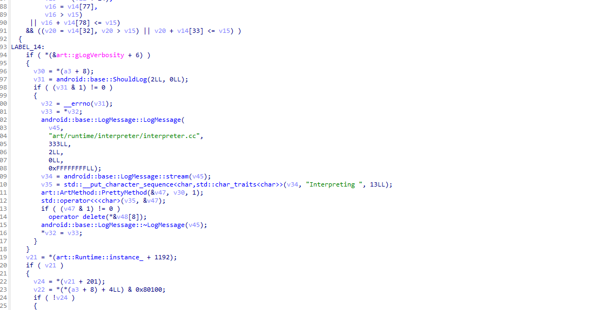
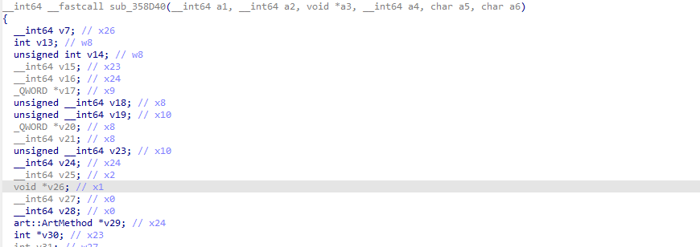

# eBPFDexDumper

[](https://golang.org/)
[](https://android.com/)

[中文](README.md) | [English](README_en.md)

Android in-memory DEX dumper powered by eBPF technology.

## Features
- **Undetectable**: Uses eBPF uprobes for stealth operation
- **Passive dump**: Non-intrusive memory analysis
- **Real-time tracing**: Optional method execution monitoring
- **Automatic fixing**: Built-in DEX file repair functionality
- **Native-layer dump & fix**: Dump .so libraries straight out of process memory (including self-mapped anonymous ELF images) and rebuild a full section header table from the `.dynamic` segment so IDA/Ghidra recognize symbols, imports/exports and relocations. Handles **ARM64/ELF64 and ARM32/ELF32**, **Android packed relocations** (APS2 / RELR), can **watch for runtime decryption**, and skips firmware libraries by default
- **High performance**: Lock-free caching and optimized string processing
- **Simplified operation**: Smart defaults, dump and fix in one command

**Showcase**: https://blog.lleavesg.top/article/eBPFDexDumper

## Supported Environment
- **Tested on**: Android 13 (Pixel 6)
- **Architecture**: ARM64
- **Requirements**: Root permission required

**Note**: On other Android versions you may need minor adjustments and rebuild.

## Prerequisites
The tool automatically removes the app's OAT optimization output to avoid `cdex` or empty results. For manual operation:
- Find base path: `pm path <package>`
- Remove oat folder: delete the app's `oat/` directory under `/data/app/.../<package>/`

Root permission is typically required to attach uprobes and read target memory.

## Usage

### Command Syntax
```
eBPFDexDumper [command] [options]
```

**Available Commands:**
- `dump` - Start eBPF-based DEX dumper
- `fix` - Fix dumped DEX files in a directory
- `dumpso` - Dump native .so libraries from a running process's memory
- `fixso` - Fix dumped .so files in a directory

### `dump` Command
Attach uprobes to libart and stream DEX/method events. You must provide either `--uid` or `--name` to filter the target app.

**Options:**
- `--uid, -u <uid>` - Filter by UID (alternative to `--name`) (default: 0)
- `--name, -n <package>` - Android package name to derive UID (alternative to `--uid`)
- `--libart, -l <path>` - Path to libart.so (default: `/apex/com.android.art/lib64/libart.so`)
- `--out, -o, --output <dir>` - Output directory on device (default: `/data/local/tmp/dex_out`)
- `--trace, -t` - Print executed methods in real time during dumping (default: false)
- `--clean-oat, -c` - Remove `/data/app/.../oat` folders of target app(s) before dumping (default: **true**)
- `--auto-fix, -f` - Automatically fix DEX files after dumping (default: **true**)
- `--no-clean-oat` - Disable automatic OAT cleaning
- `--no-auto-fix` - Disable automatic DEX fixing
- `--execute-offset <value>` - Manual offset for art::interpreter::Execute function (hex value, e.g. 0x12345)
- `--nterp-offset <value>` - Manual offset for ExecuteNterpImpl function (hex value, e.g. 0x12345)

**Examples:**
```bash
# Simplest usage - just specify package name, auto dump+clean-oat+fix
./eBPFDexDumper dump -n com.example.app

# Filter by UID
./eBPFDexDumper dump -u 10244

# Enable realtime method trace output
./eBPFDexDumper dump -n com.example.app -t

# Custom output directory
./eBPFDexDumper dump -n com.example.app -o /sdcard/dex_out

# Disable auto-fix (dump only)
./eBPFDexDumper dump -n com.example.app --no-auto-fix

# Disable auto clean-oat
./eBPFDexDumper dump -n com.example.app --no-clean-oat

# Use manual offsets for specific ART versions
./eBPFDexDumper dump -n com.example.app --execute-offset 0x12345 --nterp-offset 0x67890
```

**Output Files:**
- **DEX files**: `dex_<begin>_<size>.dex` saved under the output directory
- **Method bytecode JSON**: `dex_<begin>_<size>_code.json` saved on shutdown (SIGINT/SIGTERM) or normal exit
- **Fixed DEX files**: `fix/dex_<begin>_<size>_fix.dex` saved in `fix` subdirectory after auto-fix

### `fix` Command
Scan a directory for dumped DEX files and fix headers/structures for readability.

**Options:**
- `--dir, -d <dir>` - Directory containing dumped DEX files (required)

**Example:**
```bash
./eBPFDexDumper fix -d /data/local/tmp/out
```

### `dumpso` Command
Dump native .so libraries from a target process's memory. Unlike `dump`, this does not rely on eBPF/uprobes: it parses the target process's `/proc/<pid>/maps` directly, merges a library's separately-mapped segments (r--/r-x/rw-) back into one contiguous image, and reads it out via `process_vm_readv`. By default it also scans path-less (anonymous) memory regions and treats any whose first page starts with the ELF magic (`\x7fELF`) as a self-mapped/self-decrypted library to dump as well - useful against apps whose native-layer hardening/VMP doesn't load libraries through the normal dynamic linker path. You must provide either `--uid` or `--name` to select the target process(es). Firmware-partition libraries under `/system`, `/apex`, `/vendor` are skipped by default (they can be pulled off the device image); use `--include-system` to keep them. For hardeners that only decrypt and map a library at runtime, `--watch` keeps polling the process and dumps each new module the moment it appears.

**Options:**
- `--uid, -u <uid>` - Filter by UID (alternative to `--name`)
- `--name, -n <package>` - Android package name to derive UID (alternative to `--uid`)
- `--lib, -l <substr>` - Only dump libraries whose path contains this substring (default: all app-mapped .so files)
- `--out, -o, --output <dir>` - Output directory on device (default: `/data/local/tmp/so_out`)
- `--anon, -a` - Also scan anonymous memory regions for self-mapped ELF images (default: **true**)
- `--auto-fix, -f` - Automatically fix dumped .so files after dumping (default: **true**)
- `--no-anon` - Disable anonymous ELF region scanning
- `--no-auto-fix` - Disable automatic .so fixing
- `--include-system` - Also dump system libraries under `/system`, `/apex`, `/vendor` (skipped by default)
- `--watch, -w` - Keep watching the process and dump modules as they appear (captures runtime-decrypted libs)
- `--watch-interval <sec>` - Seconds between map re-scans in `--watch` mode (default: 1)
- `--watch-timeout <sec>` - Stop `--watch` after N seconds (0 = until interrupted, default: 60)

**Examples:**
```bash
# Simplest usage - dump every .so mapped by the app's process(es), auto-fix
./eBPFDexDumper dumpso -n com.example.app

# Dump one specific library
./eBPFDexDumper dumpso -n com.example.app -l libnative-lib.so

# Skip anonymous ELF scanning, only handle normally-linked libraries
./eBPFDexDumper dumpso -n com.example.app --no-anon

# Watch for 120s to catch a runtime-decrypted, self-mapped hardened .so
./eBPFDexDumper dumpso -n com.example.app --watch --watch-timeout 120
```

**Output Files:**
- **Raw .so**: `so_<pid>_<base>_<size>_<name>.so` saved under the output directory
- **Fixed .so**: `fix/so_<pid>_<base>_<size>_<name>_fix.so`, with a full section header table rebuilt so it drops straight into IDA/Ghidra

### `fixso` Command
Scan a directory for dumped .so files and repair them so IDA recognizes them.

The approach is inspired by [SoFixer](https://github.com/F8LEFT/SoFixer) but rewritten for Android (both ARM64/ELF64 and ARM32/ELF32): a memory-dumped .so has lost its section header table (the loader never maps it), so IDA can only load it via program headers and misses many symbols/PLT/GOT entries. This tool first normalizes each `PT_LOAD` segment's `p_offset` to `p_vaddr`, then **parses the `PT_DYNAMIC` segment** and reconstructs the addresses and sizes of `.dynsym`/`.dynstr`/`.rela.dyn`/`.rela.plt`/`.relr.dyn`/`.dynamic` and friends from the `DT_SYMTAB/STRTAB/GNU_HASH/RELA/RELR/JMPREL/PLTGOT/VERSYM/VERDEF/VERNEED/INIT_ARRAY/FINI_ARRAY` tags. Sections are sorted by address to fill in unknown sizes, each symbol's `st_shndx` (which pointed at the original layout) is remapped to the rebuilt section that contains it, and a complete section header table is appended. IDA then recognizes symbols, imports/exports and relocations just like a normal .so. The whole flow handles **both ELF32 and ELF64** (picking REL vs RELA by `EI_CLASS`) and also decodes **Android packed relocations** (`DT_ANDROID_REL/RELA`, APS2), **RELR** compressed relative relocations and **VERDEF** version definitions; after rebuilding it self-checks the output with a strict ELF parser and reports how many dynamic symbols are readable. If the target has no `PT_DYNAMIC` and can't be rebuilt, it falls back to only normalizing `p_offset` and zeroing the section headers (class-aware for 32- and 64-bit alike).

**Options:**
- `--dir, -d <dir>` - Directory containing dumped .so files (required)

**Example:**
```bash
./eBPFDexDumper fixso -d /data/local/tmp/so_out
```

## Installation & Build

### Requirements
- **Go 1.19+** for building the application
- **Android NDK** for cross-compilation
- **Android device** with ARM64 architecture
- **Root access** on the target Android device

### Build Instructions
1. **Clone the repository:**
   ```bash
   git clone https://github.com/LLeavesG/eBPFDexDumper.git
   cd eBPFDexDumper
   ```

2. **Adjust NDK path if necessary**, then build:
   ```bash
   make
   ```

3. **Push to Android device:**
   ```bash
   adb push eBPFDexDumper /data/local/tmp/
   adb shell chmod +x /data/local/tmp/eBPFDexDumper
   ```

## Troubleshooting

### 高版本Android中libart.so去除符号后如何寻找函数正确的偏移
脱壳工具可以自己寻找NterpExecuteImpl函数的偏移，方法是通过字节码匹配实现
```
F0 0B 40 D1 1F 02 40 B9 FF 83 02 D1 E8 27 00 6D EA 2F 01 6D EC 37 02 6D EE 3F 03 6D F3 53 04 A9 F5 5B 05 A9 F7 63 06 A9 F9 6B 07 A9 FB 73 08 A9 FD 7B 09 A9 16 08 40 F9
```

而对于Execute函数，需要在IDA中打开libart.so，搜索字符串"Interpreting"，然后查看哪些函数引用了这个字符串，通常会有两个函数引用它，而其中一个函数的传入参数数量为6，那么这个函数就是我们要找的Execute函数




### Common Issues

**1. UID but not PID**
You need to specify the app's uid using -u, not pid, or directly use -n to specify the package name.
Don't use -u to specify the app's pid.

**2. Binary Not Found**
```bash
# Verify file was pushed correctly
adb shell ls -la /data/local/tmp/eBPFDexDumper

# Ensure execute permissions
adb shell chmod +x /data/local/tmp/eBPFDexDumper
```

**3. Empty or Incomplete DEX Files**
- Ensure the target app is actively running (tool has `--clean-oat` enabled by default)
- If issue persists, try manual offset values
- Check if you have sufficient permissions to read target process memory

**4. Cannot Find libart.so**
```bash
# Find libart.so location on your device
adb shell find /apex -name "libart.so" 2>/dev/null
adb shell find /system -name "libart.so" 2>/dev/null
```

## References
- [cilium/ebpf](https://github.com/cilium/ebpf) - eBPF library for Go
- [ebpfmanager](https://github.com/gojue/ebpfmanager) - Go + eBPF Manager Library
- [stackplz](https://github.com/SeeFlowerX/stackplz) - StackPlz eBPF Tools
- [eDBG](https://github.com/ShinoLeah/eDBG) - eDBG eBPF Debugger
- [null-luo/btrace](https://github.com/null-luo/btrace) - Binary tracing tools
- [ART Internal Structure](https://evilpan.com/2021/12/26/art-internal/)
- [Android Runtime Analysis](https://zhuanlan.zhihu.com/p/523692715)
- [DEX File Format](https://blog.csdn.net/weixin_47668107/article/details/114251185)
- [Android Security Research](https://juejin.cn/post/7045575502991458340)
- [eBPF on Android](https://juejin.cn/post/7384992816906747913)
- [Advanced Obfuscation Techniques](https://blog.quarkslab.com/dji-the-art-of-obfuscation.html)
- [eBPF Documentation](https://blog.seeflower.dev/archives/84/#title-7)

## Contributing

Contributions are welcome! Please feel free to submit a Pull Request.


## Disclaimer

This tool is intended for educational and defensive security research purposes only. Users are responsible for ensuring compliance with applicable laws and regulations.